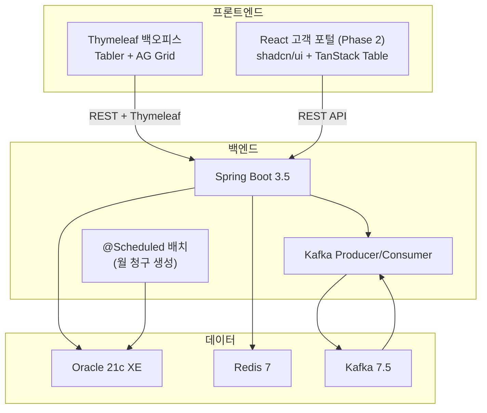

# rental-crm

> 장비 렌탈 청구 관리 시스템 — 백오피스 ERP + 고객 포털.
> SI 실무 경험(JDK 마이그레이션, SAP EAI, 대량 처리 배치)을 직접 재현하며 **대량 데이터 처리 / 쿼리 튜닝 / Kafka 이벤트 파이프라인** 을 학습.


---

## 🎯 학습 목표 — 3챕터

| 챕터 | 시나리오 | 측정 |
|---|---|---|
| **Ch.1** | 월 청구 일괄 생성 배치 — 건별 INSERT vs bulk INSERT (5만 건 대상) | `BL_BATCH_LOG.DURATION_MS` 수치 비교 |
| **Ch.2** | 미납 현황 엑셀 다운로드 — 쿼리 튜닝 (서브쿼리 → JOIN, 인덱스 활용) | Oracle EXPLAIN PLAN 전/후 비교 |
| **Ch.3** | 청구 생성 → 수납 완료 → 연체 발생 이벤트 파이프라인 (Kafka) | Producer/Consumer 양방향 토픽 + 알림 INSERT |

---

## 🛠 기술 스택

### 백엔드
- **Java 21** LTS (Gradle Toolchain — 시스템 JAVA_HOME 17 유지하며 본 프로젝트만 21)
- **Spring Boot 3.5.0** — Web / Data JPA / Validation / Kafka / Data Redis / Security / Actuator
- **Oracle 21c XE** (Docker — `gvenzl/oracle-xe:21-slim`)
- **Apache Kafka 7.5** (Producer / Consumer 양방향)
- **Redis 7** (Spring Session + 캐시)
- **Apache POI** SXSSF — 엑셀 스트리밍 다운로드
- **JJWT** — JWT 인증
- **springdoc-openapi** — Swagger UI

### 백오피스 (Thymeleaf)
- **Tabler** (Bootstrap 5) — 어드민 템플릿
- **AG Grid Community** — ERP 그리드 (페이징/정렬/필터/체크박스)
- **Chart.js** — 대시보드 시각화

### 고객 포털 (Phase 2 예정)
- React 18 + Tailwind CSS + **shadcn/ui** + TanStack Table
- Zustand / Axios / Toss Payments SDK

---

## 🏗 아키텍처



---

## 📂 디렉토리 구조

```
rental-crm/
├── .claude/rules/             # Claude 헌법 (메타룰 + 식별자 매핑)
├── docs/                      # 산출물 (01~99 .md) + ADR + 룰 + 도메인 용어집
│   ├── 01. 업무기획서.md ~ 08. 배포 가이드.md
│   ├── decisions/             # ADR-001 ~ 007
│   ├── global-rules/          # 전역 룰 (DB 컨벤션, 그리드 라이브러리)
│   └── domain-terms/          # 도메인 용어집 (접미어/한↔영)
├── infra/                     # Docker Compose 인프라
│   ├── docker-compose.yml     # Oracle + Kafka + Zookeeper + Redis + Kafka UI
│   ├── init-scripts/oracle/   # 19 테이블 + 시퀀스 + 인덱스 + 시드 데이터 DDL
│   ├── start.bat / stop.bat / status.bat / reset.bat   # Windows 더블클릭 운영
│   └── guide/                 # 인프라 로컬 가이드
├── backend/                   # Spring Boot 3.5 + Java 21
│   ├── build.gradle
│   ├── gradle.properties      # Gradle Toolchain (Java 21 경로)
│   ├── src/main/java/com/rental/crm/
│   │   ├── common/{audit,config,response,exception,controller}
│   │   ├── customer/{entity,repository,service,controller,dto}
│   │   ├── code/{entity,repository,service,controller,dto}          # 공통코드 그룹/값
│   │   ├── menu/{entity,repository,service,controller,dto}          # 2-depth 메뉴 트리
│   │   ├── auth/{entity,repository,service,controller,dto}          # 역할/AUTH 매트릭스
│   │   ├── admin/{entity,repository,service,controller,dto,security,seeder}
│   │   │   # 관리자(CM_USER) + 권한 미세조정(CM_USER_AUTH) + PermissionService + X-User-Id 필터
│   │   └── RentalCrmApplication.java
│   ├── src/main/resources/
│   │   ├── application.yml + application-{local,prod}.yml
│   │   ├── templates/         # Thymeleaf (fragments + 도메인별 페이지)
│   │   └── static/            # Tabler/AG Grid + 사용자 CSS/JS
│   └── guide/                 # 백엔드 로컬 룰 (ADR-005~006 + 컨벤션)
└── customer-portal/           # React (Phase 2)
```

---

## 🚀 실행 방법

### 사전 요구사항
- Java 21 (시스템 JAVA_HOME 17 유지 가능 — `backend/gradle.properties` 에서 Java 21 경로 지정)
- Docker Desktop (메모리 4GB+ 권장 — Oracle 부담)

### 1. 인프라 기동 (한 번에)

```powershell
cd infra
# Windows: 더블클릭
start.bat
# 또는
docker compose up -d
```

→ Oracle 첫 부팅 3~5분. 이후 `start.bat` 의 fallback 메커니즘이 init-scripts 자동 실행 검증.

### 2. 백엔드 기동

```powershell
cd backend
.\gradlew bootRun
```

- 백오피스: http://localhost:8081
- Actuator: http://localhost:8081/actuator/health
- Swagger UI: http://localhost:8081/swagger-ui.html
- Kafka UI: http://localhost:8090

### 3. 정지

```powershell
cd infra
stop.bat                   # 컨테이너 정지 (볼륨 유지)
# 또는 완전 초기화 (DB 데이터 삭제)
reset.bat                  # YES 입력 필요
```

---

## 📊 진행 상태

### Phase 1 — 백오피스 (현재 집중)

- [x] 기획·요구사항·기술스택·기능명세·ERD·API 명세·배포 가이드 (산출물 8개)
- [x] 19 테이블 ERD 컨펌 (ADR-001/002/003 + ADR-008/009 권한 모델 갱신)
- [x] 인프라 (Docker Compose + DDL + 시드 데이터)
- [x] Spring Boot 스켈레톤 + JPA Auditing (감사 9컬럼 자동 주입)
- [x] 공통 응답 포맷 / 예외 처리 / Security 기본
- [x] **고객 관리** (CRUD + AG Grid + 모달 + 사용여부 토글)
- [x] **공통코드 / 메뉴 / 권한 / 관리자** (ADR-008/009/010 권한 모델 + 사이드바 동적 렌더링)
- [ ] 장비 / 상품 / 계약 / 기사 / 방문
- [ ] 청구 / 월청구 배치 — **Ch.1 학습 핵심**
- [ ] 수납 / 연체 / Kafka 이벤트 — **Ch.3 학습 핵심**
- [ ] 통계 (미납 엑셀) — **Ch.2 학습 핵심**
- [ ] 대시보드 + Redis 캐시

### Phase 2 — 고객 포털 (Phase 1 완료 후)

- [ ] React + Tailwind + shadcn/ui 스켈레톤
- [ ] 로그인 / 청구 조회 / 카드 납부 (Toss Payments) / 납부 내역 / 계약 현황

---

## 🧩 핵심 설계 결정 (ADR)

| ADR | 결정 |
|---|---|
| [ADR-001](docs/decisions/ADR-001-erd-cm-block-revision.md) | 공통 9컬럼 (`WRK_RMK` + `FIRS_REG_*` / `FINA_REG_*` 8) — 모든 테이블 |
| [ADR-002](docs/decisions/ADR-002-erd-ct-block-revision.md) | 사람이 읽는 식별자 (`CUST-YYYYMMDD-NNNNN` 등) + 일시정지 추적 |
| [ADR-003](docs/decisions/ADR-003-erd-bl-block-revision.md) | bulk INSERT 측정 컬럼 (`TARGET_COUNT` / `SUCCESS_COUNT` / `DURATION_MS`) |
| [ADR-004](docs/decisions/ADR-004-oracle-init-scripts-known-issue.md) | Oracle init scripts 알려진 이슈 + start.bat fallback |
| [ADR-005](backend/guide/decisions/ADR-005-audit-columns-auto-injection.md) | 감사 9컬럼 자동 주입 — JPA Auditing + `@PrePersist`/`@PreUpdate` 혼합 |
| [ADR-006](backend/guide/decisions/ADR-006-spring-boot-version.md) | Spring Boot 3.5.0 + Java 21 채택 (4.x 비채택 사유) |
| [ADR-007](docs/decisions/ADR-007-ui-template-and-grid-library.md) | UI 템플릿 (Tabler) + 그리드 (AG Grid Community / TanStack Table) |
| [ADR-008](docs/decisions/ADR-008-permission-model-auth-code.md) | 권한 모델 — 메뉴 × R/W/D 폐기, AUTH 키 단위 채택 (`CM_AUTH` / `CM_ROLE_AUTH`) |
| [ADR-009](docs/decisions/ADR-009-user-direct-auth-grant-revoke.md) | 사용자 직접 권한 매핑 — 역할 폭증 회피 (`CM_USER_AUTH` GRANT/REVOKE) |
| [ADR-010](docs/decisions/ADR-010-permission-cache-and-operations.md) | 권한 캐시 (`permissions:user:{userId}` 30분) + invalidation + 회수 SLA (다음 요청부터 즉시) |

전역 룰: [docs/global-rules/](docs/global-rules/) | 도메인 용어집: [docs/domain-terms/](docs/domain-terms/)

---

## 📈 성능 측정 결과 — Ch.1 / Ch.2

> 학습 시나리오 진행 후 본 섹션에 수치 채움.

| 시나리오 | 측정값 | 환경 |
|---|---|---|
| Ch.1 — 건별 INSERT 5만 건 | TBD | TBD |
| Ch.1 — bulk INSERT 5만 건 | TBD | TBD |
| Ch.2 — 미납 현황 엑셀 (서브쿼리) | TBD | TBD |
| Ch.2 — 미납 현황 엑셀 (JOIN + 인덱스) | TBD | TBD |

---

## 📄 라이선스

MIT
