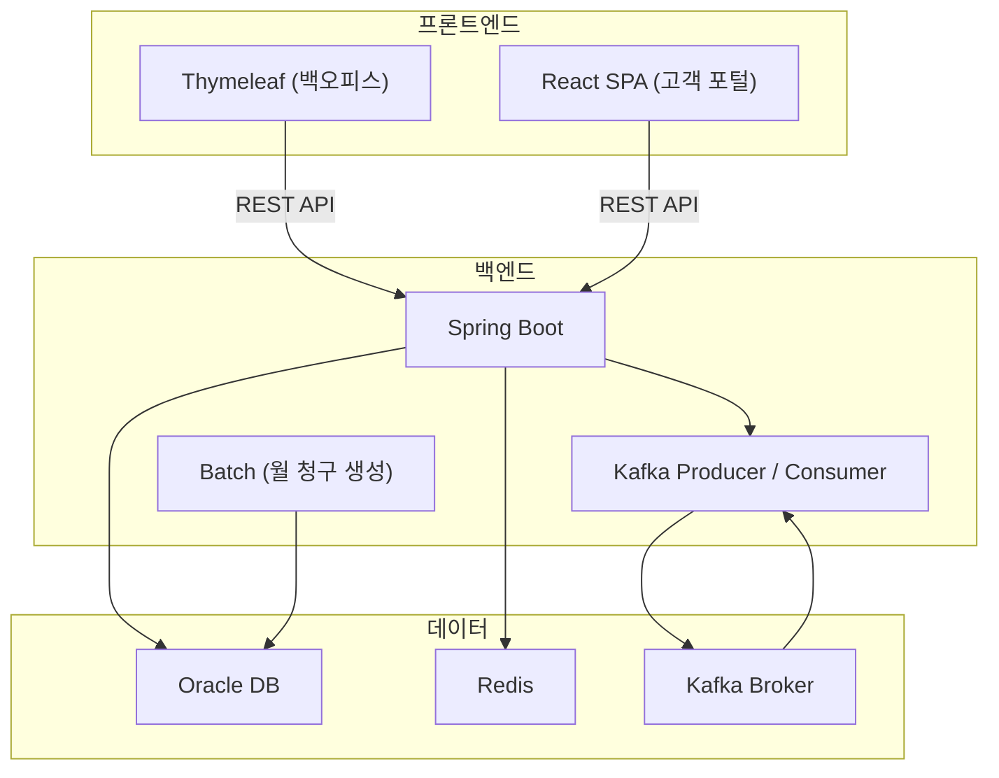

# 기술 스택 정의서

---

# 1. 확정 스택

| 영역 | 기술 | 버전 | 선정 사유 |
|---|---|---|---|
| 백오피스 | Thymeleaf | - | Spring Boot 내장 서버사이드 렌더링. 별도 빌드 불필요 |
| 고객 포털 | React | 18 | 고객용 SPA. 카드 납부 등 인터랙티브 기능 |
| 백엔드 | Spring Boot | 3.x | Java 기반 엔터프라이즈 표준. 실무 스택과 동일 |
| ORM | JPA (Hibernate) | - | 엔티티 기반 설계 학습. MyBatis 대비 객체 중심 접근 |
| DB | Oracle | 21c | 실무(경남에너지) 환경과 동일. Docker로 로컬 구성 |
| 메시지 브로커 | Kafka | - | SAP EAI 인터페이스 관리 + 경북연구원 Kafka 연계 구축 경험 기반 |
| 캐시 | Redis | - | 세션 관리, Kafka 이벤트 처리 상태 캐싱, DB 부하 감소 |
| 컨테이너 | Docker | - | Oracle / Kafka / Redis 로컬 환경 일괄 구성 |
| CI/CD | GitHub Actions | - | Push 시 자동 빌드 / 테스트 / 배포 파이프라인 |

---

# 2. 시스템 아키텍처

---

# 3. 프론트엔드 상세

**백오피스 (Thymeleaf)**

| 구분 | 기술 | 용도 |
|---|---|---|
| 템플릿 엔진 | Thymeleaf | Spring Boot 서버사이드 렌더링 |
| UI 템플릿 | **Tabler** (Bootstrap 5 기반, MIT) | 어드민 레이아웃 / 사이드바 / 카드 / 폼 |
| 데이터 그리드 | **AG Grid Community** (MIT, vanilla JS) | ERP 그리드 — 페이징/정렬/필터/체크박스/셀 에디터 |
| JS | Vanilla JS (`fetch`) | 폼 유효성, AJAX, AG Grid 제어 |
| 차트 | Chart.js | 대시보드 집계 시각화 |

> ⚠️ **Webix 사용 금지** (판권 문제). 상세: [`docs/global-rules/frontend-grid-library.md`](global-rules/frontend-grid-library.md)

**고객 포털 (React)**

| 구분 | 기술 | 용도 |
|---|---|---|
| 프레임워크 | React 18 | SPA 라우팅, 컴포넌트 기반 UI |
| CSS | **Tailwind CSS** | 유틸리티 클래스 기반 스타일 |
| UI 컴포넌트 | **shadcn/ui** (MIT) | Card / Dialog / Form / Toast / Button — CLI 로 코드 직접 도입, 자유 커스터마이징 |
| 데이터 그리드 | **TanStack Table v8** (shadcn/ui `DataTable` 으로 래핑, MIT) | 청구/납부/계약 목록 |
| 상태 관리 | Zustand | 전역 상태 (로그인, 알림) |
| HTTP 클라이언트 | Axios | REST API 호출 |
| 결제 | Toss Payments SDK | 카드 납부 위젯 |
| 디자인 시안 도구 | **Stitch** (Google AI 디자인 도구) | 5화면 시안 — 산출물 [`05 화면 설계서`](05_화면%20설계서.md) 참조 |

---

# 4. 백엔드 상세

| 구분 | 기술 | 용도 |
|---|---|---|
| 프레임워크 | Spring Boot 3.x | REST API, 배치, Kafka 연동 |
| ORM | Spring Data JPA (Hibernate) | 엔티티 매핑, JPQL, 벌크 연산 |
| 배치 | Spring Batch 또는 @Scheduled | 월 청구 일괄 생성, 만료 임박 처리 |
| Kafka | Spring Kafka | Producer / Consumer 이벤트 처리 |
| 캐시 | Spring Data Redis | 세션, 이벤트 처리 상태 캐싱 |
| 인증 | Spring Security + JWT | 관리자 / 고객 분리 인증 |
| 엑셀 | Apache POI | 대량 데이터 스트리밍 엑셀 다운로드 |
| API 문서 | Swagger (springdoc) | REST API 자동 문서화 |

---

# 5. 데이터 계층 상세

| 구분 | 기술 | 용도 |
|---|---|---|
| RDBMS | Oracle 21c | 핵심 비즈니스 데이터 (고객 / 계약 / 청구 / 수납) |
| 캐시 | Redis | 세션 토큰, Kafka Consumer 처리 상태, 대시보드 집계 캐싱 |
| 메시지 브로커 | Kafka | 청구 생성 / 수납 완료 / 연체 이벤트 파이프라인 |

---

# 6. 인프라 / 운영

| 구분 | 기술 | 용도 |
|---|---|---|
| 컨테이너 | Docker + docker-compose | Oracle / Kafka / Redis / App 로컬 환경 일괄 구성 |
| CI/CD | GitHub Actions | Push → Build → Test → Docker Build |
| 버전 관리 | Git / GitHub | 코드 관리, PR 기반 작업 |

---

# 7. 기술 선택 근거 요약

### Spring Boot
실무 환경과 동일한 스택. 엔터프라이즈 표준이며 Spring Batch / Kafka / Redis 연동이 자연스럽게 통합됨.

### JPA
MyBatis 실무 경험에서 ORM 패러다임으로 확장. 벌크 연산(`saveAll`, `@Modifying`)을 통한 대량 INSERT 성능 측정이 학습 목표.

### Oracle
경남에너지 실무와 동일 DB. EXPLAIN PLAN, MERGE 문법 등 실무 경험 그대로 재현 가능.

### Kafka
경남에너지 SAP EAI 인터페이스 관리 + 경북연구원 Kafka 연계 구축 경험을 바탕으로 선정. Producer / Consumer 양방향 설계 근거 설명 가능.

### Redis
세션 관리(다중 WAS 대비) + Kafka Consumer 처리 상태 캐싱. 대시보드 집계 결과 캐싱으로 DB 반복 조회 방지.
