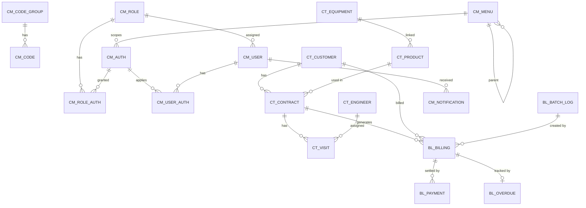

# ERD 및 테이블 정의서

---

## ERD (관계도)



> 관계 변경 (ADR-003 §2-2): `BL_BATCH_LOG → BL_BILLING` 방향. 한 배치가 다수 청구를 생성. 기존 산출물의 역방향은 오류였음.
> `BL_BILLING → BL_PAYMENT`: 1:N (결제 취소·재결제 시 동일 청구에 복수 PAYMENT 레코드 가능)

---

## 테이블 목록

| 테이블명 | 한글명 | 설명 |
|---|---|---|
| CM_CODE_GROUP | 공통코드 그룹 | 코드 분류 단위 |
| CM_CODE | 공통코드 | 코드 상세값 |
| CM_USER | 관리자 계정 | 백오피스 로그인 사용자 |
| CM_ROLE | 권한(역할) | 역할 정의 |
| CM_AUTH | 권한 키 | 기능별 권한 키 마스터 (행 단위 — ADR-008) |
| CM_ROLE_AUTH | 역할-권한 매핑 | 역할에 AUTH 키 부여 |
| CM_USER_AUTH | 사용자 권한 미세조정 | 사용자별 GRANT/REVOKE 행 (ADR-009) |
| CM_MENU | 메뉴 | 백오피스 메뉴 트리 |
| CM_NOTIFICATION | 알림 | Kafka Consumer 알림 저장 |
| CT_CUSTOMER | 고객 | 고객 포털 회원 |
| CT_EQUIPMENT | 장비 | 렌탈 장비 마스터 |
| CT_PRODUCT | 상품 | 렌탈 상품 (장비 + 금액) |
| CT_CONTRACT | 계약 | 고객-상품 계약 |
| CT_ENGINEER | 기사 | 설치/점검 기사 |
| CT_VISIT | 방문 이력 | 방문 배정 및 완료 이력 |
| BL_BILLING | 청구 | 월 청구 데이터 |
| BL_PAYMENT | 수납 | 수납 처리 이력 |
| BL_OVERDUE | 연체 | 연체 발생/해제 이력 |
| BL_BATCH_LOG | 배치 실행 이력 | 배치 멱등성 + 처리 결과 기록 |

---

## 테이블별 컬럼 정의

### CM_CODE_GROUP (공통코드 그룹)

| 컬럼명 | 타입 | NOT NULL | PK/FK | 설명 |
|---|---|---|---|---|
| GROUP_CODE | VARCHAR2(50) | Y | PK | 그룹 코드 (예: EQUIPMENT_TYPE) |
| GROUP_NAME | VARCHAR2(100) | Y | | 그룹명 |
| DESCRIPTION | VARCHAR2(500) | | | 그룹 설명 |
| SYSTEM_YN | CHAR(1) | Y | | 시스템 예약 (Y=수정/삭제/하위 코드 추가 일체 차단), 기본값 N |
| USE_YN | CHAR(1) | Y | | 사용여부 (Y/N), 기본값 Y |

> 공통 9컬럼(`WRK_RMK` + 감사 8) 적용 — §공통 설계 규칙 참조

---

### CM_CODE (공통코드)

| 컬럼명 | 타입 | NOT NULL | PK/FK | 설명 |
|---|---|---|---|---|
| CODE_ID | NUMBER | Y | PK | 코드 ID (시퀀스) |
| GROUP_CODE | VARCHAR2(50) | Y | FK | CM_CODE_GROUP.GROUP_CODE |
| CODE_VALUE | VARCHAR2(50) | Y | | 코드값 (그룹 내 유니크) |
| CODE_NAME | VARCHAR2(100) | Y | | 코드 표시명 |
| SORT_ORDER | NUMBER | Y | | 정렬 순서, 기본값 0 |
| DESCRIPTION | VARCHAR2(200) | | | 코드 설명 (모호한 코드값 부연) |
| PROP_VAL1 | VARCHAR2(100) | | | 확장 속성 1 (도메인별 자유 사용 — 단축어/표시색/외부키 등) |
| PROP_VAL2 | VARCHAR2(100) | | | 확장 속성 2 |
| PROP_VAL3 | VARCHAR2(100) | | | 확장 속성 3 |
| USE_YN | CHAR(1) | Y | | 사용여부, 기본값 Y |

> UNIQUE (GROUP_CODE, CODE_VALUE)
> INDEX `IDX_CM_CODE_GROUP` (GROUP_CODE, USE_YN, SORT_ORDER) — 그룹 내 사용중 코드 정렬 조회 빈번
> 공통 9컬럼(`WRK_RMK` + 감사 8) 적용 — §공통 설계 규칙 참조

---

### CM_ROLE (권한/역할)

| 컬럼명 | 타입 | NOT NULL | PK/FK | 설명 |
|---|---|---|---|---|
| ROLE_ID | NUMBER | Y | PK | 역할 ID |
| ROLE_CODE | VARCHAR2(50) | Y | | 역할 코드 (예: SUPER_ADMIN) |
| ROLE_NAME | VARCHAR2(100) | Y | | 역할명 |
| DESCRIPTION | VARCHAR2(500) | | | 설명 |
| USE_YN | CHAR(1) | Y | | 사용여부, 기본값 Y |

> UNIQUE (ROLE_CODE)
> 공통 9컬럼(`WRK_RMK` + 감사 8) 적용 — §공통 설계 규칙 참조

---

### CM_MENU (메뉴)

| 컬럼명 | 타입 | NOT NULL | PK/FK | 설명 |
|---|---|---|---|---|
| MENU_ID | NUMBER | Y | PK | 메뉴 ID |
| PARENT_MENU_ID | NUMBER | | FK | CM_MENU.MENU_ID (상위 메뉴, NULL = 루트) |
| MENU_DEPTH | NUMBER | Y | | 메뉴 깊이 (1=루트, 2=하위) |
| MENU_NAME | VARCHAR2(100) | Y | | 메뉴명 |
| MENU_TYPE | VARCHAR2(20) | Y | | `GROUP`(자식 펼침) / `LEAF`(페이지 이동) |
| MENU_URL | VARCHAR2(200) | | | 메뉴 URL (LEAF 일 때만) |
| ICON_CLASS | VARCHAR2(50) | | | AdminLTE 아이콘 클래스 (예: `fa fa-users`) |
| SORT_ORDER | NUMBER | Y | | 정렬 순서, 기본값 0 |
| USE_YN | CHAR(1) | Y | | 사용여부, 기본값 Y |

> 공통 9컬럼(`WRK_RMK` + 감사 8) 적용 — §공통 설계 규칙 참조

---

### CM_AUTH (권한 키 마스터)

> ADR-008 — 메뉴 × R/W/D 매트릭스 폐기, AUTH 키 단위 채택.

| 컬럼명 | 타입 | NOT NULL | PK/FK | 설명 |
|---|---|---|---|---|
| AUTH_CODE | VARCHAR2(50) | Y | PK | 권한 키 (예: `CUSTOMER_EXPORT`, `BILLING_BATCH_RUN`) |
| AUTH_NAME | VARCHAR2(100) | Y | | 한글명 |
| MENU_ID | NUMBER | | FK | CM_MENU.MENU_ID. **NULL 허용** (메뉴 무관 글로벌 권한) |
| AUTH_TYPE | VARCHAR2(20) | Y | | `VIEW` / `CREATE` / `UPDATE` / `DELETE` / `EXECUTE` |
| SORT_ORDER | NUMBER | Y | | 정렬 순서, 기본값 0 |
| USE_YN | CHAR(1) | Y | | 사용여부, 기본값 Y |

> INDEX `IDX_CM_AUTH_MENU` (MENU_ID, SORT_ORDER) — 메뉴별 권한 조회 빈번
> 공통 9컬럼(`WRK_RMK` + 감사 8) 적용 — §공통 설계 규칙 참조

**AUTH_CODE 명명 컨벤션 (ADR-008 §2-3)**
- 형식: `{모듈}_{액션}` — 영문 대문자 + 언더스코어
- 예: `CUSTOMER_VIEW`, `CUSTOMER_EXPORT`, `BILLING_BATCH_RUN`, `USER_UNLOCK`

---

### CM_ROLE_AUTH (역할-권한 매핑)

| 컬럼명 | 타입 | NOT NULL | PK/FK | 설명 |
|---|---|---|---|---|
| ROLE_AUTH_ID | NUMBER | Y | PK | 매핑 ID (시퀀스) |
| ROLE_ID | NUMBER | Y | FK | CM_ROLE.ROLE_ID |
| AUTH_CODE | VARCHAR2(50) | Y | FK | CM_AUTH.AUTH_CODE |

> UNIQUE (ROLE_ID, AUTH_CODE)
> 공통 9컬럼(`WRK_RMK` + 감사 8) 적용 — §공통 설계 규칙 참조

---

### CM_USER (관리자 계정)

| 컬럼명 | 타입 | NOT NULL | PK/FK | 설명 |
|---|---|---|---|---|
| USER_ID | NUMBER | Y | PK | 관리자 ID |
| EMAIL | VARCHAR2(200) | Y | | 이메일 (로그인 ID) |
| PASSWORD | VARCHAR2(255) | Y | | BCrypt 암호화 비밀번호 |
| USER_NAME | VARCHAR2(100) | Y | | 이름 |
| PHONE | VARCHAR2(20) | | | 연락처 |
| ROLE_ID | NUMBER | | FK | CM_ROLE.ROLE_ID |
| USE_YN | CHAR(1) | Y | | 사용여부, 기본값 Y |
| LOGIN_FAIL_CNT | NUMBER | Y | | 연속 로그인 실패 횟수, 기본값 0 |
| LOCKED_AT | TIMESTAMP | | | 계정 잠금 일시 (잠금 해제 정책: §정책 메모 참조) |
| LAST_LOGIN_AT | TIMESTAMP | | | 마지막 로그인 일시 |

> UNIQUE (EMAIL)
> 공통 9컬럼(`WRK_RMK` + 감사 8) 적용 — §공통 설계 규칙 참조

**잠금 해제 정책 (ADR-001 기록)**
- 5회 연속 로그인 실패 시 `LOCKED_AT = SYSDATE` 기록
- 로그인 시도 시 `LOCKED_AT + 30분 < SYSDATE` 이면 자동 해제 + `LOGIN_FAIL_CNT = 0` 리셋
- 관리자 수동 해제 가능 (`LOCKED_AT = NULL`, `LOGIN_FAIL_CNT = 0`)

---

### CM_USER_AUTH (사용자 권한 미세 조정)

> ADR-009 — 역할 권한에서 사용자별 GRANT/REVOKE 로 미세 조정. 역할 폭증 회피.

| 컬럼명 | 타입 | NOT NULL | PK/FK | 설명 |
|---|---|---|---|---|
| USER_AUTH_ID | NUMBER | Y | PK | 매핑 ID (시퀀스) |
| USER_ID | NUMBER | Y | FK | CM_USER.USER_ID |
| AUTH_CODE | VARCHAR2(50) | Y | FK | CM_AUTH.AUTH_CODE |
| GRANT_TYPE | VARCHAR2(10) | Y | | `GRANT` (역할 권한에 추가) / `REVOKE` (역할 권한에서 제외) |

> UNIQUE (USER_ID, AUTH_CODE)
> CHECK GRANT_TYPE IN ('GRANT', 'REVOKE')
> INDEX `IDX_CM_USER_AUTH_USER` (USER_ID) — 사용자별 권한 조회 빈번
> 공통 9컬럼(`WRK_RMK` + 감사 8) 적용 — §공통 설계 규칙 참조

**권한 판정 (ADR-009 §2-2)**

```
최종 권한 = (역할 권한) ∪ (사용자 GRANT) − (사용자 REVOKE)
```

---

### CM_NOTIFICATION (알림)

| 컬럼명 | 타입 | NOT NULL | PK/FK | 설명 |
|---|---|---|---|---|
| NOTIFICATION_ID | NUMBER | Y | PK | 알림 ID |
| RECIPIENT_USER_ID | NUMBER | | FK | CM_USER.USER_ID — 수신자. NULL=전체 관리자 broadcast |
| NOTIFICATION_TYPE | VARCHAR2(50) | Y | | BILLING_CREATED / PAYMENT_COMPLETED / PAYMENT_OVERDUE / VISIT_ASSIGNED |
| MESSAGE | VARCHAR2(1000) | Y | | 알림 메시지 본문 |
| REF_TYPE | VARCHAR2(50) | | | 참조 테이블 타입 (예: `BILLING`, `VISIT`, `PAYMENT`) |
| REF_ID | NUMBER | | | 참조 ID (REF_TYPE 기준 PK) |
| READ_YN | CHAR(1) | Y | | 읽음 여부, 기본값 N |

> INDEX `IDX_CM_NOTIFICATION_UNREAD` (READ_YN, CREATED_AT DESC) — 미읽음 최신순 조회 빈번
> 공통 9컬럼(`WRK_RMK` + 감사 8) 적용 — §공통 설계 규칙 참조
> ⚠️ 알림 시계열 로그 특성상 `WRK_RMK` 와 감사 컬럼이 과한 측면 있음. 우선 일관성 위해 적용 — 운영 부담 발생 시 ADR 로 예외 처리 검토

---

### CT_CUSTOMER (고객)

| 컬럼명 | 타입 | NOT NULL | PK/FK | 설명 |
|---|---|---|---|---|
| CUSTOMER_ID | NUMBER | Y | PK | 고객 ID (시퀀스 `SEQ_CT_CUSTOMER`) |
| CUSTOMER_NO | VARCHAR2(20) | Y | | 고객번호 (예: `CUST-20260511-00001`) |
| CUSTOMER_NAME | VARCHAR2(100) | Y | | 고객명 |
| EMAIL | VARCHAR2(254) | Y | | 이메일 (고객 포털 로그인 ID, RFC 5321) |
| PASSWORD | VARCHAR2(255) | Y | | BCrypt 암호화 비밀번호 |
| PHONE | VARCHAR2(20) | Y | | 연락처 |
| BIRTH_DATE | DATE | | | 생년월일 (본인 인증용, 선택) |
| ADDRESS_ZIP | VARCHAR2(10) | | | 우편번호 |
| ADDRESS | VARCHAR2(500) | Y | | 주소 (기본 + 상세 통합) |
| TERMS_AGREE_YN | CHAR(1) | Y | | 약관 동의 (Y/N), 회원가입 필수 |
| USE_YN | CHAR(1) | Y | | 활성여부, 기본값 Y |
| LOGIN_FAIL_CNT | NUMBER | Y | | 연속 로그인 실패 횟수, 기본값 0 |
| LOCKED_AT | TIMESTAMP(0) | | | 계정 잠금 일시 (잠금 정책: CM_USER 와 동일 — ADR-001 §2-5 참조) |
| LAST_LOGIN_AT | TIMESTAMP(0) | | | 마지막 로그인 일시 |

> UNIQUE (EMAIL)
> UNIQUE (CUSTOMER_NO)
> INDEX `IDX_CT_CUSTOMER_NAME` (CUSTOMER_NAME) — 고객명 LIKE 검색
> INDEX `IDX_CT_CUSTOMER_PHONE` (PHONE) — 연락처 LIKE 검색
> 공통 9컬럼(`WRK_RMK` + 감사 8) 적용 — §공통 설계 규칙 참조

---

### CT_EQUIPMENT (장비)

| 컬럼명 | 타입 | NOT NULL | PK/FK | 설명 |
|---|---|---|---|---|
| EQUIPMENT_ID | NUMBER | Y | PK | 장비 ID (시퀀스 `SEQ_CT_EQUIPMENT`) |
| EQUIPMENT_CODE | VARCHAR2(20) | Y | | 장비코드 (예: `EQ-AC-0001`) |
| EQUIPMENT_TYPE | VARCHAR2(50) | Y | | CM_CODE 그룹 `EQUIPMENT_TYPE` (가전/가구/IT장비/의료장비) |
| MODEL_NAME | VARCHAR2(200) | Y | | 모델명 |
| MANUFACTURER | VARCHAR2(200) | Y | | 제조사 |
| RELEASE_DATE | DATE | | | 출시일 (단종 관리 보조) |
| IMAGE_URL | VARCHAR2(500) | | | 장비 이미지 URL (고객 포털 표시) |
| DESCRIPTION | VARCHAR2(1000) | | | 장비 설명 |
| STOCK_QTY | NUMBER | Y | | 재고 수량 (총 보유 수량), DEFAULT 0. 가용 수량 = STOCK_QTY − 활성 계약 수 (동적 계산) |
| USE_YN | CHAR(1) | Y | | 사용여부, 기본값 Y (`N`=단종) |

> UNIQUE (MODEL_NAME, MANUFACTURER)
> UNIQUE (EQUIPMENT_CODE)
> INDEX `IDX_CT_EQUIPMENT_TYPE` (EQUIPMENT_TYPE, USE_YN) — 유형별 사용중 장비 조회
> 공통 9컬럼(`WRK_RMK` + 감사 8) 적용 — §공통 설계 규칙 참조

**재고 정책 (rental-crm 단순화 결정)**
- `STOCK_QTY` 는 총 보유 수량만. 입출고 이력 테이블 / 가용 수량 정적 컬럼 없음.
- 가용 수량 = `STOCK_QTY − (해당 장비를 쓰는 상품의 활성 계약 수 합산)` — 매 조회 시 동적 계산 (계약 도메인 작업 시 적용).
- 입출고 관리 화면 없음 — 장비 등록/수정 시 `STOCK_QTY` 직접 입력.
- 학습 단계 단순화 결정 — 실무 운영 시스템에선 별도 입출고 도메인 + 동시성 처리 필요.

---

### CT_PRODUCT (상품)

| 컬럼명 | 타입 | NOT NULL | PK/FK | 설명 |
|---|---|---|---|---|
| PRODUCT_ID | NUMBER | Y | PK | 상품 ID (시퀀스 `SEQ_CT_PRODUCT`) |
| PRODUCT_CODE | VARCHAR2(20) | Y | | 상품코드 (예: `PROD-AC-0001`) |
| EQUIPMENT_ID | NUMBER | Y | FK | CT_EQUIPMENT.EQUIPMENT_ID |
| PRODUCT_NAME | VARCHAR2(200) | Y | | 상품명 |
| MONTHLY_FEE | NUMBER | Y | | 월 렌탈료 (원 단위, 0 초과) |
| CONTRACT_MONTHS | NUMBER | Y | | 기본 계약 기간 (개월, 1 이상) |
| DEPOSIT_AMOUNT | NUMBER | Y | | 보증금 (기본 0) |
| INSTALL_FEE | NUMBER | Y | | 설치비 (1회성, 기본 0) |
| DESCRIPTION | VARCHAR2(1000) | | | 상품 설명 |
| USE_YN | CHAR(1) | Y | | 사용여부, 기본값 Y |

> UNIQUE (PRODUCT_CODE)
> INDEX `IDX_CT_PRODUCT_EQUIPMENT` (EQUIPMENT_ID, USE_YN) — 장비별 사용중 상품 조회
> 공통 9컬럼(`WRK_RMK` + 감사 8) 적용 — §공통 설계 규칙 참조

---

### CT_CONTRACT (계약)

| 컬럼명 | 타입 | NOT NULL | PK/FK | 설명 |
|---|---|---|---|---|
| CONTRACT_ID | NUMBER | Y | PK | 계약 ID (시퀀스 `SEQ_CT_CONTRACT`) |
| CONTRACT_NO | VARCHAR2(50) | Y | | 계약번호 (예: `CT-20260511-00001`) |
| CUSTOMER_ID | NUMBER | Y | FK | CT_CUSTOMER.CUSTOMER_ID |
| PRODUCT_ID | NUMBER | Y | FK | CT_PRODUCT.PRODUCT_ID |
| MONTHLY_FEE | NUMBER | Y | | 계약 시점 월 렌탈료 스냅샷 (상품가 변경에 영향 없도록) |
| START_DATE | DATE | Y | | 계약 시작일 |
| END_DATE | DATE | Y | | 계약 종료일 (END_DATE > START_DATE) |
| INSTALL_ADDRESS | VARCHAR2(500) | Y | | 설치 주소 |
| CONTRACT_STATUS | VARCHAR2(20) | Y | | `ACTIVE` / `SUSPENDED` / `TERMINATED`, 기본값 `ACTIVE` |
| SUSPENDED_AT | TIMESTAMP(0) | | | 일시정지 시작 일시 |
| SUSPEND_REASON | VARCHAR2(1000) | | | 일시정지 사유 |
| RESUMED_AT | TIMESTAMP(0) | | | 재개 일시 |
| TERMINATED_AT | TIMESTAMP(0) | | | 해지 일시 |
| TERMINATE_REASON | VARCHAR2(1000) | | | 해지 사유 |

> UNIQUE (CONTRACT_NO)
> INDEX `IDX_CT_CONTRACT_CUSTOMER` (CUSTOMER_ID, CONTRACT_STATUS) — 고객별 계약 조회 (상태별 필터)
> INDEX `IDX_CT_CONTRACT_STATUS` (CONTRACT_STATUS) — 월청구 배치 대상 조회 (`ACTIVE` 만)
> INDEX `IDX_CT_CONTRACT_END_DATE` (END_DATE, CONTRACT_STATUS) — 만료 임박 계약 조회
> 공통 9컬럼(`WRK_RMK` + 감사 8) 적용 — §공통 설계 규칙 참조

---

### CT_ENGINEER (기사)

| 컬럼명 | 타입 | NOT NULL | PK/FK | 설명 |
|---|---|---|---|---|
| ENGINEER_ID | NUMBER | Y | PK | 기사 ID (시퀀스 `SEQ_CT_ENGINEER`) |
| ENGINEER_CODE | VARCHAR2(20) | Y | | 기사코드 (예: `ENG-00001`) |
| ENGINEER_NAME | VARCHAR2(100) | Y | | 기사명 |
| ENGINEER_TYPE | VARCHAR2(20) | Y | | `INTERNAL` / `EXTERNAL` (내부 직원 / 외주), 기본값 `INTERNAL` |
| PHONE | VARCHAR2(20) | Y | | 연락처 |
| EMAIL | VARCHAR2(254) | | | 이메일 |
| AREA | VARCHAR2(100) | | | 담당 지역 (자유 텍스트, 추후 코드화 검토) |
| USE_YN | CHAR(1) | Y | | 사용여부, 기본값 Y |

> UNIQUE (ENGINEER_CODE)
> INDEX `IDX_CT_ENGINEER_AREA` (AREA, USE_YN) — 지역별 가용 기사 조회
> 공통 9컬럼(`WRK_RMK` + 감사 8) 적용 — §공통 설계 규칙 참조

---

### CT_VISIT (방문 이력)

| 컬럼명 | 타입 | NOT NULL | PK/FK | 설명 |
|---|---|---|---|---|
| VISIT_ID | NUMBER | Y | PK | 방문 ID (시퀀스 `SEQ_CT_VISIT`) |
| CONTRACT_ID | NUMBER | Y | FK | CT_CONTRACT.CONTRACT_ID |
| ENGINEER_ID | NUMBER | Y | FK | CT_ENGINEER.ENGINEER_ID |
| VISIT_TYPE | VARCHAR2(20) | Y | | CM_CODE 그룹 `VISIT_TYPE` (`INSTALL` / `CHECK` / `COLLECT`) |
| SCHEDULED_DATE | DATE | Y | | 방문 예정일 (오늘 이후만 허용 — 04 §5-1) |
| COMPLETED_DATE | DATE | | | 방문 완료일 |
| VISIT_STATUS | VARCHAR2(20) | Y | | `SCHEDULED` / `COMPLETED` / `CANCELLED`, 기본값 `SCHEDULED` |
| CANCEL_REASON | VARCHAR2(1000) | | | 취소 사유 (VISIT_STATUS=`CANCELLED` 시 필수) |
| MEMO | VARCHAR2(1000) | | | 방문 메모 |

> INDEX `IDX_CT_VISIT_ENGINEER_DATE` (ENGINEER_ID, SCHEDULED_DATE) — 기사별 일정 조회 (5건 초과 경고 — 04 §5-1)
> INDEX `IDX_CT_VISIT_CONTRACT` (CONTRACT_ID, VISIT_STATUS) — 계약별 방문 이력
> 공통 9컬럼(`WRK_RMK` + 감사 8) 적용 — §공통 설계 규칙 참조

---

### BL_BILLING (청구)

| 컬럼명 | 타입 | NOT NULL | PK/FK | 설명 |
|---|---|---|---|---|
| BILLING_ID | NUMBER | Y | PK | 청구 ID (시퀀스 `SEQ_BL_BILLING`) |
| BILLING_NO | VARCHAR2(50) | Y | | 청구번호 (예: `BILL-202605-000001`) |
| CONTRACT_ID | NUMBER | Y | FK | CT_CONTRACT.CONTRACT_ID |
| CUSTOMER_ID | NUMBER | Y | FK | CT_CUSTOMER.CUSTOMER_ID (조회 최적화용 역정규화) |
| BATCH_LOG_ID | NUMBER | | FK | BL_BATCH_LOG.BATCH_LOG_ID (어느 배치에서 생성됐는지 추적) |
| BILLING_MONTH | VARCHAR2(7) | Y | | 청구월 (`YYYY-MM`) |
| BILLING_AMOUNT | NUMBER | Y | | 청구금액 |
| ISSUE_DATE | DATE | Y | | 청구 발행일 (배치 실행일 — 통상 청구월 1일) |
| DUE_DATE | DATE | Y | | 납기일 (청구월 말일) |
| BILLING_STATUS | VARCHAR2(20) | Y | | `UNPAID` / `OVERDUE` / `PAID` / `CANCELLED`, 기본값 `UNPAID` |
| PAID_AT | TIMESTAMP(0) | | | 수납 완료 일시 (BL_PAYMENT 연동 시 채워짐 — 조회 최적화) |

> UNIQUE (CONTRACT_ID, BILLING_MONTH) — 동일 계약 동일 청구월 중복 방지 (멱등성)
> UNIQUE (BILLING_NO)
> INDEX `IDX_BL_BILLING_CUSTOMER` (CUSTOMER_ID, BILLING_MONTH DESC) — 고객별 청구 이력 (최근 12건)
> INDEX `IDX_BL_BILLING_STATUS_DUE` (BILLING_STATUS, DUE_DATE) — 연체 배치 대상 (`UNPAID` + `DUE_DATE < SYSDATE`)
> INDEX `IDX_BL_BILLING_MONTH` (BILLING_MONTH, BILLING_STATUS) — 월별 통계 / 대시보드
> 공통 9컬럼(`WRK_RMK` + 감사 8) 적용 — §공통 설계 규칙 참조

---

### BL_PAYMENT (수납)

| 컬럼명 | 타입 | NOT NULL | PK/FK | 설명 |
|---|---|---|---|---|
| PAYMENT_ID | NUMBER | Y | PK | 수납 ID (시퀀스 `SEQ_BL_PAYMENT`) |
| PAYMENT_NO | VARCHAR2(50) | Y | | 수납번호 (예: `PAY-202605-000001`) |
| BILLING_ID | NUMBER | Y | FK | BL_BILLING.BILLING_ID |
| CUSTOMER_ID | NUMBER | Y | FK | CT_CUSTOMER.CUSTOMER_ID |
| PAYMENT_AMOUNT | NUMBER | Y | | 수납금액 (0 초과) |
| PAYMENT_METHOD | VARCHAR2(20) | Y | | CM_CODE 그룹 `PAYMENT_METHOD` (`CARD` / `BANK` / `CASH` / `TOSS`) |
| PAYMENT_DATE | DATE | Y | | 수납일 (오늘 이전만 허용) |
| PAYMENT_STATUS | VARCHAR2(20) | Y | | `COMPLETED` / `CANCELLED` / `REFUNDED`, 기본값 `COMPLETED` |
| CANCELLED_AT | TIMESTAMP(0) | | | 결제 취소 일시 |
| CANCEL_REASON | VARCHAR2(1000) | | | 결제 취소 사유 |
| TOSS_ORDER_ID | VARCHAR2(200) | | | Toss Payments 주문번호 (PAYMENT_METHOD=`TOSS` 일 때) |
| TOSS_PAYMENT_KEY | VARCHAR2(200) | | | Toss Payments 결제키 |

> UNIQUE (PAYMENT_NO)
> UNIQUE (TOSS_ORDER_ID) — Toss 결제 중복 방지 (NULL 허용 — 비 Toss 수납은 NULL)
> INDEX `IDX_BL_PAYMENT_BILLING` (BILLING_ID, PAYMENT_STATUS) — 청구별 수납 조회
> INDEX `IDX_BL_PAYMENT_CUSTOMER_DATE` (CUSTOMER_ID, PAYMENT_DATE DESC) — 고객별 납부 이력 (최신순)
> INDEX `IDX_BL_PAYMENT_DATE_METHOD` (PAYMENT_DATE, PAYMENT_METHOD) — 일별/수단별 통계
> 공통 9컬럼(`WRK_RMK` + 감사 8) 적용 — §공통 설계 규칙 참조

---

### BL_OVERDUE (연체)

| 컬럼명 | 타입 | NOT NULL | PK/FK | 설명 |
|---|---|---|---|---|
| OVERDUE_ID | NUMBER | Y | PK | 연체 ID (시퀀스 `SEQ_BL_OVERDUE`) |
| BILLING_ID | NUMBER | Y | FK | BL_BILLING.BILLING_ID |
| CUSTOMER_ID | NUMBER | Y | FK | CT_CUSTOMER.CUSTOMER_ID |
| OVERDUE_AMOUNT | NUMBER | Y | | 연체금액 (BL_BILLING.BILLING_AMOUNT 스냅샷) |
| OVERDUE_DAYS | NUMBER | Y | | 연체일수 (배치 실행 시점 기준) |
| RESOLVED_AT | TIMESTAMP(0) | | | 해제 일시 (NULL = 미해결) |
| RESOLVE_REASON | VARCHAR2(1000) | | | 해제 사유 (수납 / 수동 해제 / 계약해지) |

> UNIQUE (BILLING_ID) — 한 청구당 한 연체 레코드만 (재발생 시 RESOLVED_AT 갱신, 새 레코드 X)
> INDEX `IDX_BL_OVERDUE_CUSTOMER_RESOLVED` (CUSTOMER_ID, RESOLVED_AT) — 고객별 미해결 연체 조회 (`RESOLVED_AT IS NULL`)
> INDEX `IDX_BL_OVERDUE_DAYS` (OVERDUE_DAYS DESC) — 장기 연체자 통계
> 공통 9컬럼(`WRK_RMK` + 감사 8) 적용 — §공통 설계 규칙 참조

---

### BL_BATCH_LOG (배치 실행 이력)

| 컬럼명 | 타입 | NOT NULL | PK/FK | 설명 |
|---|---|---|---|---|
| BATCH_LOG_ID | NUMBER | Y | PK | 배치 로그 ID (시퀀스 `SEQ_BL_BATCH_LOG`) |
| BATCH_TYPE | VARCHAR2(50) | Y | | `BILLING_CREATE` / `OVERDUE_UPDATE` |
| BILLING_MONTH | VARCHAR2(7) | | | 청구월 (`YYYY-MM`) — `BILLING_CREATE` 배치 식별용 |
| BATCH_STATUS | VARCHAR2(20) | Y | | `RUNNING` / `COMPLETED` / `FAILED`, 기본값 `RUNNING` |
| TARGET_COUNT | NUMBER | Y | | 처리 대상 건수 (배치 시작 시 산정), 기본값 0 |
| PROCESS_COUNT | NUMBER | Y | | 실제 처리 시도 건수, 기본값 0 |
| SUCCESS_COUNT | NUMBER | Y | | 성공 건수, 기본값 0 |
| FAIL_COUNT | NUMBER | Y | | 실패 건수, 기본값 0 |
| DURATION_MS | NUMBER | | | 실행 시간 (밀리초 — Ch.1 성능 측정용) |
| ERROR_MSG | VARCHAR2(2000) | | | 실패 시 오류 메시지 |
| STARTED_AT | TIMESTAMP(0) | Y | | 배치 시작 일시 |
| COMPLETED_AT | TIMESTAMP(0) | | | 배치 완료 일시 |

> UNIQUE (BATCH_TYPE, BILLING_MONTH) — 멱등성 체크 기준 (동일 청구월 중복 실행 차단)
> INDEX `IDX_BL_BATCH_LOG_STARTED` (STARTED_AT DESC) — 최근 배치 이력 조회
> INDEX `IDX_BL_BATCH_LOG_TYPE_STATUS` (BATCH_TYPE, BATCH_STATUS) — 실패 배치 재실행 검색
> 공통 9컬럼(`WRK_RMK` + 감사 8) 적용 — §공통 설계 규칙 참조

---

## 공통 설계 규칙

### 1. 공통 9컬럼 — 모든 테이블 필수

다음 9개 컬럼은 **모든 테이블(마스터/디테일/라이브러리 무관)에 반드시 존재**. 각 테이블 정의에는 반복 명시하지 않으며, 각 테이블 끝에 "공통 9컬럼 적용" 메모로 대체.

| 순서 | 컬럼명 | 타입 | NOT NULL | DEFAULT | 설명 |
|---|---|---|---|---|---|
| 1 | `WRK_RMK` | VARCHAR2(100) | N | | 업무비고 (자유 메모 — 모든 테이블 공통) |
| 2 | `FIRS_REG_PGM_ID` | VARCHAR2(50) | Y | | 최초등록 프로그램ID |
| 3 | `FIRS_REG_DTS` | TIMESTAMP(0) | Y | `CURRENT_TIMESTAMP` | 최초등록 일시 |
| 4 | `FIRS_REG_USER_ID` | VARCHAR2(20) | Y | | 최초등록자 ID |
| 5 | `FIRS_REG_IP` | VARCHAR2(50) | Y | | 최초등록 IP |
| 6 | `FINA_REG_PGM_ID` | VARCHAR2(50) | Y | | 최종수정 프로그램ID |
| 7 | `FINA_REG_DTS` | TIMESTAMP(0) | Y | `CURRENT_TIMESTAMP` | 최종수정 일시 |
| 8 | `FINA_REG_USER_ID` | VARCHAR2(20) | Y | | 최종수정자 ID |
| 9 | `FINA_REG_IP` | VARCHAR2(50) | Y | | 최종수정 IP |

> 본 9컬럼 패턴은 참고 프로젝트(GDI) 의 감사 컬럼 컨벤션을 차용. 출처: `참고프로젝트/guide/03. coding-rules/project/db/audit-columns.md`
> 각 테이블 정의 표의 `CREATED_AT` / `UPDATED_AT` 컬럼은 본 9컬럼으로 **대체** (기존 산출물 표기는 호환 표기로 간주).

### 2. PK 생성 전략

- **테이블별 SEQUENCE 1:1 매핑** — 예: `SEQ_CM_USER`, `SEQ_BL_BILLING`
- Oracle SEQUENCE + JPA `@SequenceGenerator(allocationSize = 50)` — 시퀀스 round-trip 최소화
- `GENERATED ALWAYS AS IDENTITY` 는 **사용 금지** — Hibernate batch insert 비활성화 → Ch.1 bulk INSERT 학습 목표와 충돌

### 3. 명명 규칙

- **케이스**: 테이블·컬럼명 모두 **대문자 + 언더스코어** (`CM_USER`, `BILLING_AMOUNT`)
- **테이블 prefix**: `CM_` (공통/권한/알림), `CT_` (계약/장비/고객), `BL_` (청구/수납/배치)
- **비즈니스 컬럼**: 풀네임 사용 (`BILLING_AMOUNT`, `CONTRACT_NO`) — 약어 패턴 미적용
- **컬럼 도메인 (접미어 → 타입)**: `docs/domain-terms/suffix.md` 참조 (rental-crm 도메인 단어 사전)

### 4. 데이터 타입

- 날짜만: `DATE`, 일시: `TIMESTAMP(0)` (초 단위)
- 상태값: `VARCHAR2` + Enum 문자열 직접 저장 (예: `ACTIVE`, `UNPAID`)
- 금액: `NUMBER` (정수 — 원 단위)
- 플래그(`*_YN`): **`VARCHAR2(1)`** — 'Y' / 'N' 만 허용 (`docs/global-rules/db-conventions.md` §1)

### 5. 소프트 삭제

- `USE_YN = 'N'` 처리. 물리 삭제 지양.
- 시계열 로그성 테이블(`CM_NOTIFICATION`, `BL_BATCH_LOG`)은 USE_YN 없음 — 영구 보존 또는 별도 아카이브 정책

### 6. 인덱스 정책

- PK / UNIQUE 외에 **빈번한 조회 패턴 기준으로 보조 인덱스** 명시
- 각 테이블 정의 표 아래 `> INDEX ...` 줄로 표기
- DDL 작성 시 `IDX_<테이블>_<용도>` 명명

### 7. 역정규화

- `BL_BILLING.CUSTOMER_ID` — 청구 조회 시 JOIN 비용 절감 목적 (정규화 위반 의식적 채택)
